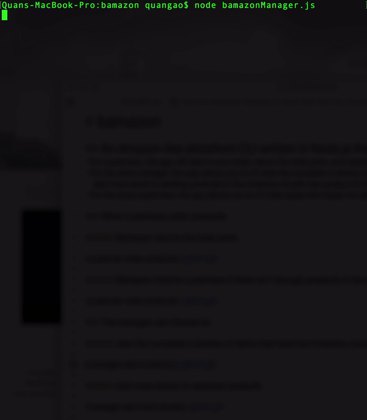

# bamazon

## An Amazon-like storefront CLI written in Node.js that
* For customers, the app will take in your order, return the total price, and deplete stock from the store's inventory.
* For the store manager, the app allows you to (1) view the complete inventory (2) view products that have low inventory count (3) add more stock to existing products in the inventory (4) add new product to the store
* For the store supervisor, the app allows you to (1) view sales information for all departments of the store (2) add new department

### When customers order products:

##### Bamazon returns the total price:

##### Bamazon informs customers if there isn't enough products in stock:

### The manager can choose to:

##### View the complete inventory or items that have low inventory count:

##### Restock products. For example, Pusheen plush stock is low, let's add more!
Note that after stocking up, it is not in the low inventory table anymore:

##### Add new product (milk in this case).
Note that milk is in the inventory table now.

### The supervisor can either view sales by department:

### Or create new department:

